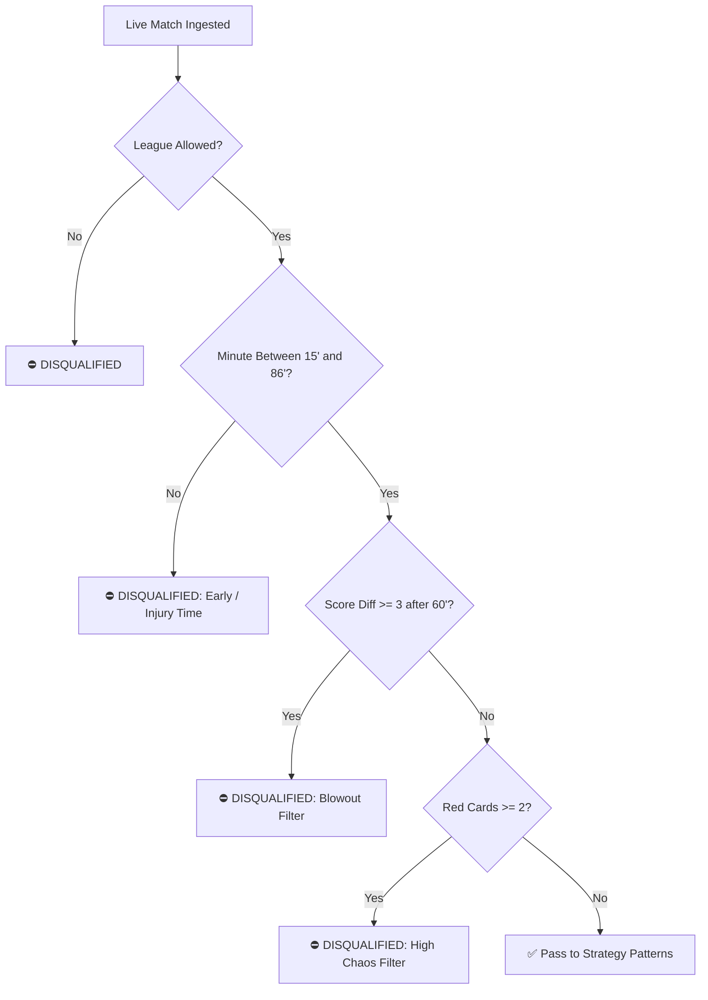

# Quantitative In-Play Betting Strategy & Sizing Guide

> **Document Version**: 2.0 (SofaScore Zero-Cost Real-Time Engine)  
> **Source Module**: [`strategy.py`](file:///c:/Users/dount/Documents/antigravity/dntbettor/strategy.py)  
> **Target Sportsbook**: Stake.com  

---

## 1. Executive Summary & Core Philosophy

The autonomous betting agent operates on a **quantitative, value-oriented in-play execution model**. Rather than placing pre-match speculative bets, the system monitors live football matches in real time, measuring **expected goals (xG)**, **shot quality in the penalty box**, **10-minute Attack Momentum**, and **scoreline dynamics** to find market mispricings.

### Core Tenets:
1. **Patience Over Volume**: The bot selectively rejects ~95% of matches, executing only when mathematical conviction exceeds the safety threshold ($\ge 75\%$).
2. **Dynamic Kelly-Scaled Sizing**: Bet sizes scale with available bankroll and conviction rating rather than flat unit staking.
3. **Strict Disqualification Filters**: The bot will never chase blowouts, early chaos, or high-variance red card anomalies.
4. **Autonomous Capital Protection**: Volume caps ($4\text{ bets/day}$, $25\text{ bets/week}$) and a $-20\%$ drawdown circuit breaker protect against adverse variance runs.

---

## 2. Real-Time Data Ingestion Matrix

All statistics are parsed in real time via [`sofascore_client.py`](file:///c:/Users/dount/Documents/antigravity/dntbettor/sofascore_client.py) at **$0 API cost**:

| Metric | Description | Strategic Purpose |
| :--- | :--- | :--- |
| **Match Clock & Score** | In-play minute and current scoreline | Filters timing windows and score variance |
| **Cumulative xG** | Live Expected Goals for Home / Away | Measures underlying shot quality |
| **Shots Inside Box** | Shots taken within the 18-yard penalty area | Filters out low-threat long-distance shooting |
| **Attack Momentum** | Minute-by-minute SofaScore momentum graph | Calculates 10-minute trailing pressure & dominant side |
| **Corners & Box Crosses**| Set piece count and box entries | Indicates sustained pressure during deadlocks |
| **Disciplinary Cards** | Yellow and Red card counts | Flags chaotic or abnormal game states |

---

## 3. Disqualification Gates ("When NOT to Bet")

Before evaluating any strategy patterns, a match must pass through 4 strict disqualification gates in [`strategy.py`](file:///c:/Users/dount/Documents/antigravity/dntbettor/strategy.py):



### Disqualification Rules:
* **Gate 0 (League Filter)**: If `ALLOWED_LEAGUES` is specified in `.env`, only whitelisted competitions (e.g. Premier League, UCL, LaLiga) are processed.
* **Gate 1 (Time Boundary)**: Rejects matches before minute $15'$ (market stabilization period) and after minute $86'$ (injury time volatility and illiquid markets).
* **Gate 2 (Blowout Filter)**: Rejects matches where $\Delta\text{Score} \ge 3$ after minute $60'$. In blowouts, teams lower pressing intensity and make defensive substitutions, destroying statistical predictability.
* **Gate 3 (Chaos Filter)**: Rejects matches with 2 or more red cards due to abnormal structural collapse.

---

## 4. Quantitative Strategy Patterns ("When to Bet")

When a match passes all disqualification gates, it is evaluated against 5 high-conviction quantitative patterns:

---

### 🟢 Pattern 1: xG Surge & Box Pressure Over
* **Time Window**: Minutes $55'$ – $78'$
* **Score State**: Total goals $\le 3$, Goal difference $\le 1$ (tight game)
* **Trigger Conditions**:
  $$\text{Total xG} \ge 1.4 \quad\text{OR}\quad \text{Total Box Shots} \ge 7 \quad\text{OR}\quad \text{Momentum}_{\text{last 10m}} > 30$$
* **Target Market**: `Over (Current Goals + 0.5) Match Goals`
* **Conviction Score**: $82\%$ – $88\%$ (Risk: LOW / MEDIUM)
* **Estimated Odds**: $1.70$ – $1.85$
* **Mathematical Rationale**: High volume of inside-the-box opportunities during a close second half indicates imminent goal conversion.

---

### 🟢 Pattern 2: Trailing Dominant Team Push
* **Time Window**: Minutes $50'$ – $75'$
* **Score State**: Home team trailing $0-1$
* **Trigger Conditions**:
  $$\text{Home xG} \ge 0.80 \quad\text{OR}\quad \text{Home Momentum}_{\text{last 10m}} \ge 25 \quad\text{OR}\quad \text{Home Box Shots} \ge 4$$
* **Target Market**: `{Home Team} or Draw (Double Chance 1X)`
* **Conviction Score**: $83\%$ (Risk: MEDIUM)
* **Estimated Odds**: $1.80$ – $1.95$
* **Mathematical Rationale**: A dominant home side trailing against the run of play creates strong positive expected value (+EV) on 1X lines.

---

### 🟢 Pattern 3: Second-Half General Goal Pressure
* **Time Window**: Minutes $58'$ – $76'$
* **Score State**: Total goals in $(1, 2, 3)$, Goal difference $\le 1$
* **Trigger Conditions**: Sustained attacking tempo and end-to-end play
* **Target Market**: `Over (Current Goals + 0.5) Match Goals`
* **Conviction Score**: $79\%$ – $84\%$ (Risk: LOW / MEDIUM)
* **Estimated Odds**: $1.70$ – $1.80$
* **Mathematical Rationale**: High-pace second halves with close scorelines produce fatigue in defensive lines and open transition space.

---

### 🟢 Pattern 4: Late Deadlock Goal Push
* **Time Window**: Minutes $77'$ – $85'$
* **Score State**: Deadlock tie ($0-0$, $1-1$, or $2-2$)
* **Trigger Conditions**:
  $$\text{Total Corners} \ge 7 \quad\text{OR}\quad \text{Total Box Shots} \ge 6$$
* **Target Market**: `Over (Current Goals + 0.5) Match Goals`
* **Conviction Score**: $76\%$ – $80\%$ (Risk: MEDIUM)
* **Estimated Odds**: $2.00$ – $2.25$
* **Mathematical Rationale**: High corner and set-piece counts in late drawn matches generate counter-attack overloads and high-value odds.

---

### 🟢 Pattern 5: First-Half Momentum Breakout
* **Time Window**: Minutes $22'$ – $36'$
* **Score State**: $0-0$ Deadlock
* **Trigger Conditions**:
  $$\text{Total Box Shots} \ge 3 \quad\text{OR}\quad \text{Total xG} \ge 0.60 \quad\text{OR}\quad \text{Momentum}_{\text{last 10m}} > 30$$
* **Target Market**: `Over 0.5 First Half Goals`
* **Conviction Score**: $80\%$ (Risk: LOW)
* **Estimated Odds**: $1.60$ – $1.70$
* **Mathematical Rationale**: Early box threat that has not yet resulted in a goal offers strong value before the halftime interval.

---

## 5. Dynamic Bet Sizing Algorithm

The bot employs a **Kelly-inspired dynamic stake sizing algorithm** implemented in [`strategy.py:calculate_dynamic_stake`](file:///c:/Users/dount/Documents/antigravity/dntbettor/strategy.py#L46):

### Formula:

$$\text{Base Stake} = \text{Active Bankroll} \times \text{BASE\_BANKROLL\_PERCENT}$$

$$\text{Conviction Multiplier} = 1.0 + \left(\frac{\text{Confidence} - \text{MIN\_CONFIDENCE}}{1.0 - \text{MIN\_CONFIDENCE}}\right) \times 0.75$$

$$\text{Odds Damping Factor} = \min\left(1.0, \frac{2.0}{\max(1.0, \text{Odds})}\right)$$

$$\text{Raw Stake} = \text{Base Stake} \times \text{Conviction Multiplier} \times \text{Odds Damping Factor}$$

$$\text{Final Stake} = \max(\text{MIN\_STAKE}, \min(\text{Raw Stake}, \text{MAX\_BET\_CAP}))$$

### Sizing Parameters (Configurable in `.env`):
| Parameter | Default | Description |
| :--- | :--- | :--- |
| `BASE_BANKROLL_PERCENT` | `0.02` (2.0%) | Base capital allocation per trade |
| `MIN_CONFIDENCE_THRESHOLD` | `0.75` (75%) | Minimum confidence required to trigger sizing |
| `MIN_STAKE` | `$0.50` | Hard floor per bet |
| `MAX_BET_CAP` | `$10.00` | Hard safety ceiling per bet |
| `MIN_ODDS` / `MAX_ODDS` | `1.40` / `4.50` | Permitted decimal odds envelope |

### Example Stake Calculation Table ($100 Bankroll):
| Conviction | Estimated Odds | Base Stake | Conviction Mult | Odds Damp | Final Stake |
| :--- | :--- | :--- | :--- | :--- | :--- |
| **75% (Base)** | 1.80 | $2.00 | 1.00x | 1.00x | **$2.00** |
| **85% (Medium)**| 1.80 | $2.00 | 1.30x | 1.00x | **$2.60** |
| **95% (High)** | 1.80 | $2.00 | 1.60x | 1.00x | **$3.20** |
| **85% (High Odds)**| 3.50 | $2.00 | 1.30x | 0.57x | **$1.49** (Variance Damped) |
| **Large Bankroll ($1000)**| 1.80 | $20.00 | 1.30x | 1.00x | **$10.00** (Capped at Max Cap) |

---

## 6. Risk Management & Profit Allocation

### 1. Volume Caps (Anti-Overtrading)
* **Maximum Daily Bets**: $4$ bets per 24 hours (`MAX_DAILY_BETS`).
* **Maximum Weekly Bets**: $25$ bets per 7 days (`MAX_WEEKLY_BETS`).
* **Daily Stop-Loss**: Halts betting if losses in a single day exceed `$50.00` (`DAILY_STOP_LOSS`).

### 2. Circuit Breaker
* If active bankroll drops by **20%** from peak/initial capital, the Circuit Breaker trips:
  * Halts all automated bet placements immediately.
  * Dispatches emergency Telegram alert.
  * Requires explicit user review via `python bot.py --financials`.

### 3. 4-Bucket Profit Distribution Waterfall
When bets win, net profits are divided automatically in the SQLite financial ledger:
```
Net Win Profit
├── 40% ➔ User Monthly Wage Pool (payout via USDT_BSC)
├── 20% ➔ Bot Bills Reserve Pool (covers VPS & Proxies)
├── 30% ➔ Bankroll Compounding (grows base bankroll safely)
└── 10% ➔ Emergency Buffer Pool (absorbs drawdowns)
```

---

## 7. Verification & Simulation

To test the strategy rules without placing bets:
```powershell
# 1. Run offline unit tests for decision logic and dynamic sizing
python test_strategy.py

# 2. Test live SofaScore metric extraction and strategy triggers
python test_sofascore.py

# 3. Run the full bot in paper-trading simulation mode
python bot.py --single-cycle
```
